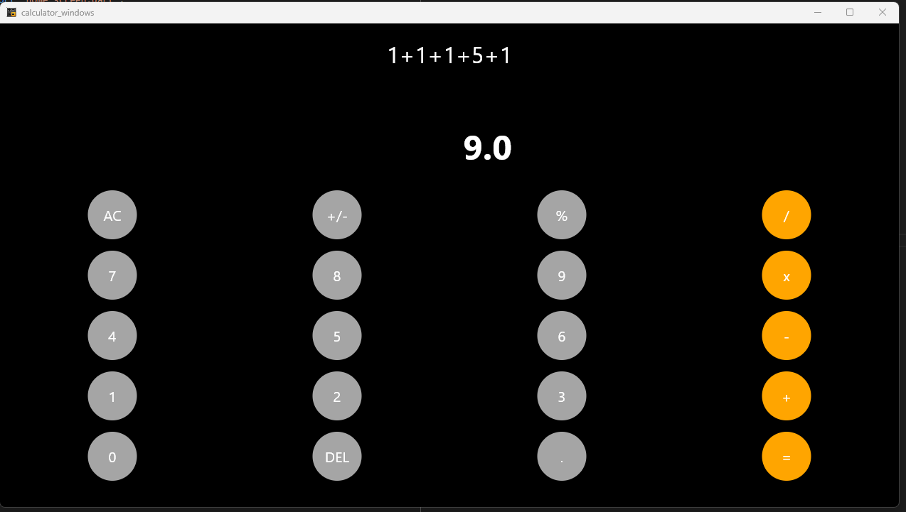

# 🧮 Basic Calculator in Flutter

A simple and elegant calculator built using **Flutter**.  
This project demonstrates a clean UI layout, button-based user interactions, and expression parsing using the `math_expressions` package.  
Works on **Windows, macOS, Linux, Android, and Web** (Flutter cross-platform power 💪).

---

## 🚀 Features

✅ Beautiful and responsive UI  
✅ Supports basic arithmetic operations (+, –, ×, ÷, %)  
✅ Expression parsing using `math_expressions`  
✅ Works seamlessly on **desktop** and **mobile**  
✅ Custom circular buttons and color-coded operators  

---

## 📸 Screenshots

### 🏠 Home Screen

### 🧮 In Action

---

## 🧰 Project Structure

